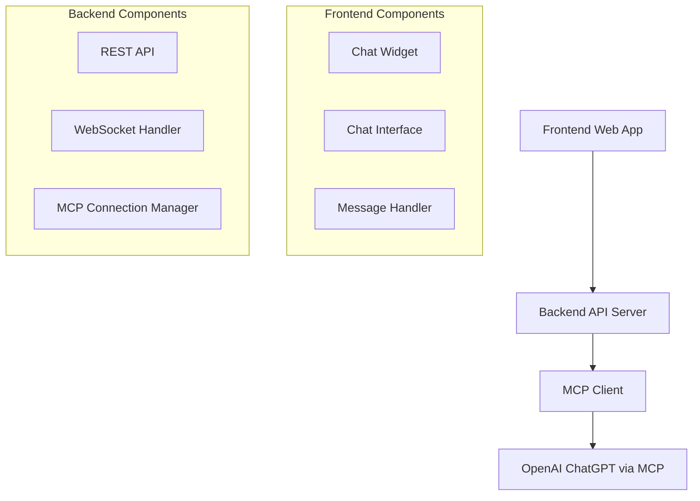

# Design Document

## Overview

O chatbot web será uma aplicação Single Page Application (SPA) construída com tecnologias web modernas que se integra com o ChatGPT da OpenAI através do protocolo MCP (Model Context Protocol). A arquitetura seguirá o padrão cliente-servidor, onde o frontend web se comunica com um backend que gerencia a conexão MCP.

## Architecture

### High-Level Architecture



### Technology Stack

**Frontend:**
- HTML5, CSS3, JavaScript (ES6+)
- Framework: React.js ou Vanilla JS (para simplicidade do MVP)
- WebSocket client para comunicação em tempo real
- CSS responsivo com abordagem mobile-first
- CSS Grid/Flexbox para layouts adaptativos
- Media queries para breakpoints específicos
- Touch-friendly interface para dispositivos móveis

**Backend:**
- Node.js com Express.js
- WebSocket server (ws ou socket.io)
- MCP client library
- Middleware para CORS e tratamento de erros

**Protocolo de Comunicação:**
- REST API para configuração inicial
- WebSocket para mensagens de chat em tempo real
- MCP para comunicação com OpenAI ChatGPT

## Components and Interfaces

### Frontend Components

#### 1. ChatWidget Component
**Responsabilidade:** Gerenciar o ícone flutuante e estado de abertura/fechamento do chat

**Interface:**
```javascript
class ChatWidget {
  constructor(containerId, config)
  show()
  hide()
  toggle()
  isOpen()
  adjustForMobile()
  adjustForDesktop()
}
```

**Propriedades:**
- Position: fixed bottom-right
- Z-index: alto para sobreposição
- Animações de abertura/fechamento
- **Responsividade:**
  - Desktop: Ícone 60x60px, margem 20px das bordas
  - Mobile: Ícone 50x50px, margem 15px das bordas
  - Tablet: Ícone 55x55px, margem 18px das bordas

#### 2. ChatInterface Component
**Responsabilidade:** Interface principal do chat com área de mensagens e input

**Interface:**
```javascript
class ChatInterface {
  constructor(websocketUrl)
  sendMessage(message)
  receiveMessage(message)
  showTypingIndicator()
  hideTypingIndicator()
  clearHistory()
  resizeForViewport()
  handleOrientationChange()
}
```

**Elementos:**
- Header com título e botão fechar
- Área de mensagens com scroll automático
- Input field com botão enviar
- Indicador de "digitando"

**Design Responsivo:**
- **Desktop (>1024px):**
  - Janela: 400px largura x 600px altura
  - Posição: bottom-right com margem
  - Header: 50px altura
  - Input area: 60px altura
- **Tablet (768px-1024px):**
  - Janela: 350px largura x 500px altura
  - Adaptação automática para orientação
- **Mobile (<768px):**
  - Janela: 100% largura x 70% altura da viewport
  - Posição: fullscreen overlay em portrait
  - Header: 45px altura com botões maiores
  - Input area: 55px altura com botão touch-friendly
  - Keyboard handling: ajuste automático quando teclado virtual aparece

#### 3. MessageHandler Component
**Responsabilidade:** Gerenciar o estado das mensagens e comunicação WebSocket

**Interface:**
```javascript
class MessageHandler {
  connect(websocketUrl)
  disconnect()
  sendMessage(message)
  onMessageReceived(callback)
  onConnectionError(callback)
}
```

### Backend Components

#### 1. REST API Endpoints
```
GET /api/health - Health check
POST /api/chat/init - Inicializar sessão de chat
GET /api/config - Obter configurações do chatbot
```

#### 2. WebSocket Handler
**Responsabilidade:** Gerenciar conexões WebSocket e roteamento de mensagens

**Interface:**
```javascript
class WebSocketHandler {
  handleConnection(socket)
  handleMessage(socket, message)
  handleDisconnection(socket)
  broadcastMessage(message)
}
```

#### 3. MCP Connection Manager
**Responsabilidade:** Gerenciar conexão e comunicação com OpenAI via MCP

**Interface:**
```javascript
class MCPConnectionManager {
  initialize(config)
  connect()
  disconnect()
  sendQuery(message)
  onResponse(callback)
  handleError(error)
}
```

## Data Models

### Message Model
```javascript
{
  id: string,
  type: 'user' | 'bot' | 'system',
  content: string,
  timestamp: Date,
  sessionId: string,
  metadata?: {
    error?: boolean,
    typing?: boolean
  }
}
```

### Session Model
```javascript
{
  sessionId: string,
  userId?: string,
  startTime: Date,
  lastActivity: Date,
  messages: Message[],
  status: 'active' | 'inactive' | 'error'
}
```

### MCP Configuration Model
```javascript
{
  serverUrl: string,
  apiKey: string,
  modelName: string,
  maxTokens: number,
  temperature: number,
  systemPrompt: string
}
```

## Error Handling

### Frontend Error Handling
1. **Conexão WebSocket perdida:** Tentar reconexão automática com backoff exponencial
2. **Mensagem não enviada:** Mostrar indicador de erro e opção de reenvio
3. **Resposta inválida:** Exibir mensagem de erro genérica ao usuário
4. **Timeout:** Mostrar mensagem de timeout após 30 segundos

### Backend Error Handling
1. **Falha na conexão MCP:** Log detalhado e resposta de erro estruturada
2. **Rate limiting:** Implementar queue de mensagens e throttling
3. **Erro de autenticação:** Retornar erro 401 com mensagem específica
4. **Erro interno:** Log completo e resposta genérica ao cliente

### Error Response Format
```javascript
{
  error: true,
  code: 'ERROR_CODE',
  message: 'User-friendly message',
  details?: 'Technical details for debugging'
}
```

## Responsive Design Strategy

### Mobile-First Approach
O design seguirá a abordagem mobile-first, onde o CSS base é otimizado para dispositivos móveis e depois expandido para telas maiores através de media queries.

### CSS Breakpoints
```css
/* Mobile First - Base styles */
.chat-widget { /* Mobile styles */ }

/* Tablet */
@media (min-width: 768px) {
  .chat-widget { /* Tablet adjustments */ }
}

/* Desktop */
@media (min-width: 1024px) {
  .chat-widget { /* Desktop adjustments */ }
}

/* Large Desktop */
@media (min-width: 1440px) {
  .chat-widget { /* Large screen optimizations */ }
}
```

### Touch Interactions
- **Botões:** Mínimo 44px x 44px para facilitar toque
- **Áreas clicáveis:** Espaçamento adequado entre elementos
- **Gestos:** Suporte a swipe para fechar chat em mobile
- **Feedback tátil:** Animações visuais para confirmar interações

### Viewport Considerations
- **Meta viewport:** `<meta name="viewport" content="width=device-width, initial-scale=1">`
- **Orientação:** Adaptação automática para portrait/landscape
- **Teclado virtual:** Ajuste da interface quando teclado aparece
- **Safe areas:** Consideração para notch e barras de sistema

### Performance Mobile
- **Lazy loading:** Carregamento progressivo de mensagens antigas
- **Otimização de imagens:** Compressão e formatos modernos
- **Bundle size:** Minimização do JavaScript para carregamento rápido
- **Caching:** Estratégia de cache para recursos estáticos

## Testing Strategy

### Unit Tests
- **Frontend:** Testar componentes individuais com Jest e React Testing Library
- **Backend:** Testar handlers, managers e utilitários com Jest
- **MCP Integration:** Mock da conexão MCP para testes isolados

### Integration Tests
- **API Endpoints:** Testar fluxo completo de requisições REST
- **WebSocket Communication:** Testar envio/recebimento de mensagens
- **MCP Flow:** Testar integração end-to-end com mock do OpenAI

### E2E Tests
- **Chat Flow:** Simular interação completa do usuário
- **Error Scenarios:** Testar comportamento em cenários de erro
- **Responsive Design:** Testar em diferentes tamanhos de tela

### Performance Tests
- **WebSocket Connections:** Testar múltiplas conexões simultâneas
- **Message Throughput:** Testar volume de mensagens
- **Memory Usage:** Monitorar vazamentos de memória

## Security Considerations

### Frontend Security
- Sanitização de input do usuário
- Validação de mensagens recebidas
- Proteção contra XSS

### Backend Security
- Validação de dados de entrada
- Rate limiting por IP/sessão
- Sanitização de respostas do MCP
- Configuração segura de CORS

### MCP Security
- Armazenamento seguro de credenciais
- Validação de certificados SSL
- Timeout adequado para requisições
- Log de tentativas de acesso

## Deployment Architecture

### Development Environment
- Frontend: Servidor de desenvolvimento local (Vite/Webpack)
- Backend: Node.js local com hot reload
- MCP: Configuração de desenvolvimento com mock

### Production Environment
- Frontend: Build estático servido via CDN ou servidor web
- Backend: Node.js em container Docker
- MCP: Conexão segura com OpenAI
- Monitoring: Logs estruturados e métricas de performance