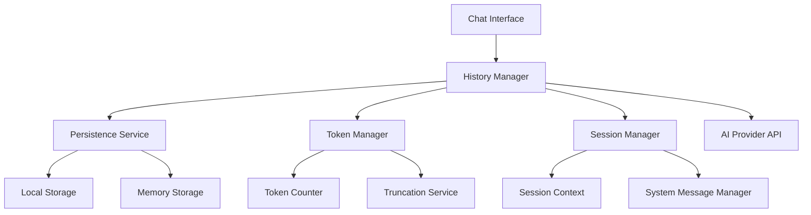
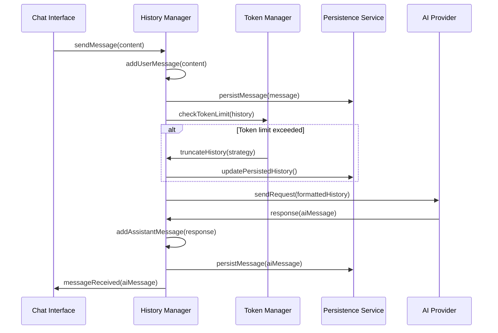
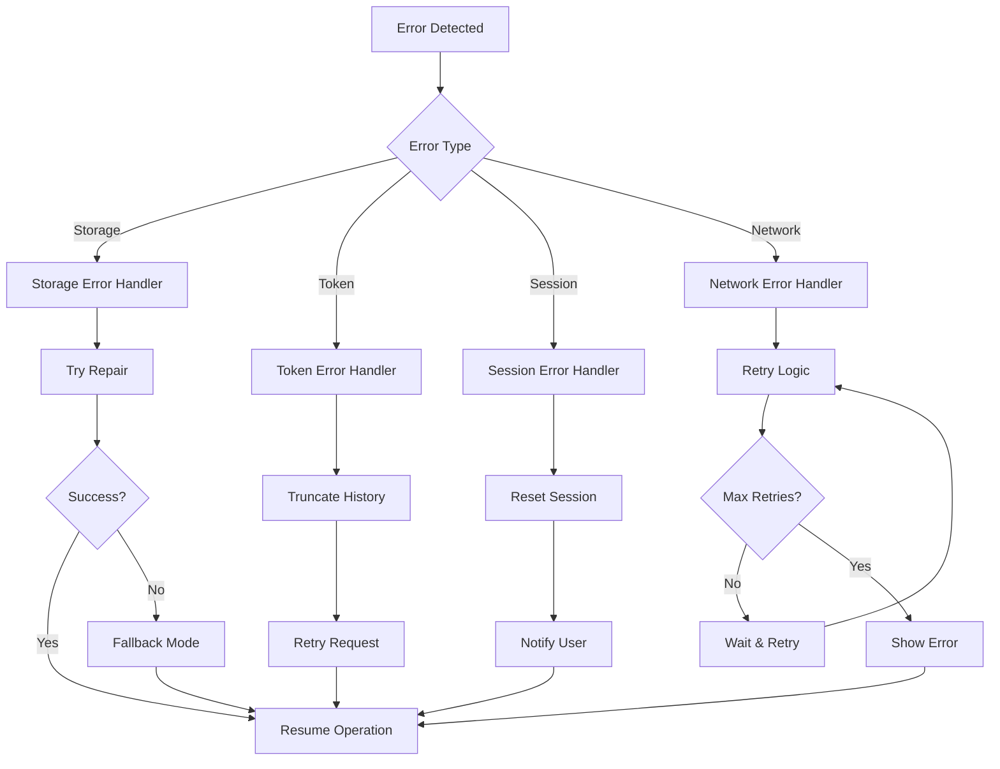

# Design Document - Gerenciamento de Histórico de Conversas

## Overview

O sistema de gerenciamento de histórico de conversas será implementado como uma camada intermediária entre o frontend e as chamadas da API de LLM. Ele manterá o contexto completo da conversa, gerenciará limites de tokens, e garantirá persistência entre sessões. A arquitetura seguirá o padrão Repository para abstração de armazenamento e Observer para notificações de mudanças.

## Architecture

### High-Level Architecture



### Component Interaction Flow



## Components and Interfaces

### 1. ConversationHistoryManager

**Responsabilidade:** Coordena todo o gerenciamento de histórico de conversas.

```javascript
class ConversationHistoryManager {
  constructor(config = {}) {
    this.sessionId = null;
    this.messages = [];
    this.systemMessage = null;
    this.persistenceService = new PersistenceService(config.storage);
    this.tokenManager = new TokenManager(config.tokenLimits);
    this.sessionManager = new SessionManager();
    this.observers = [];
  }

  // Core message management
  async addUserMessage(content, metadata = {})
  async addAssistantMessage(content, metadata = {})
  async addSystemMessage(content)
  
  // History operations
  getFormattedHistory()
  getDisplayHistory()
  clearHistory()
  
  // Session management
  async startNewSession(context = {})
  async loadSession(sessionId)
  async endSession()
  
  // API integration
  async prepareApiPayload()
  async processApiResponse(response)
  
  // Event handling
  subscribe(observer)
  unsubscribe(observer)
  notify(event, data)
}
```

### 2. PersistenceService

**Responsabilidade:** Gerencia armazenamento e recuperação de dados de histórico.

```javascript
class PersistenceService {
  constructor(storageType = 'localStorage') {
    this.storage = this.initializeStorage(storageType);
    this.keyPrefix = 'chatbot_history_';
  }

  // Storage operations
  async saveSession(sessionId, data)
  async loadSession(sessionId)
  async deleteSession(sessionId)
  async listSessions()
  
  // Message operations
  async saveMessage(sessionId, message)
  async loadMessages(sessionId)
  async deleteMessages(sessionId)
  
  // Maintenance
  async cleanup(maxAge = 7 * 24 * 60 * 60 * 1000) // 7 days
  async migrate(fromVersion, toVersion)
  
  // Error handling
  async validateData(data)
  async repairCorruptedData(sessionId)
}
```

### 3. TokenManager

**Responsabilidade:** Gerencia limites de tokens e estratégias de truncamento.

```javascript
class TokenManager {
  constructor(config = {}) {
    this.maxTokens = config.maxTokens || 4000;
    this.reserveTokens = config.reserveTokens || 500;
    this.truncationStrategy = config.strategy || 'sliding_window';
  }

  // Token counting
  estimateTokens(text)
  calculateHistoryTokens(messages)
  
  // Truncation strategies
  async truncateHistory(messages, strategy = this.truncationStrategy)
  slidingWindowTruncation(messages, maxTokens)
  importanceBasedTruncation(messages, maxTokens)
  summarizationTruncation(messages, maxTokens)
  
  // Validation
  validateTokenLimit(messages)
  getOptimalTruncationPoint(messages)
}
```

### 4. SessionManager

**Responsabilidade:** Gerencia contexto e metadados de sessões.

```javascript
class SessionManager {
  constructor() {
    this.currentSession = null;
    this.sessionContext = {};
    this.systemMessageTemplate = null;
  }

  // Session lifecycle
  createSession(context = {})
  updateSessionContext(updates)
  getSessionInfo()
  
  // System message management
  generateSystemMessage(context)
  updateSystemMessage(newContext)
  
  // Context management
  setContext(key, value)
  getContext(key)
  clearContext()
  
  // Session metadata
  getSessionMetrics()
  updateSessionMetrics(metrics)
}
```

### 5. MessageFormatter

**Responsabilidade:** Formata mensagens para diferentes contextos (API, UI, storage).

```javascript
class MessageFormatter {
  // API formatting
  static formatForApi(messages, provider = 'openai')
  static formatOpenAIMessages(messages)
  static formatOpenRouterMessages(messages)
  
  // UI formatting
  static formatForDisplay(message)
  static formatTimestamp(timestamp)
  
  // Storage formatting
  static formatForStorage(message)
  static parseFromStorage(data)
  
  // Validation
  static validateMessageFormat(message)
  static sanitizeContent(content)
}
```

## Data Models

### Message Model

```javascript
const MessageSchema = {
  id: 'string', // UUID
  sessionId: 'string',
  role: 'user|assistant|system',
  content: 'string',
  timestamp: 'ISO8601 string',
  metadata: {
    tokenCount: 'number',
    provider: 'string',
    model: 'string',
    processingTime: 'number',
    truncated: 'boolean'
  }
};
```

### Session Model

```javascript
const SessionSchema = {
  id: 'string', // UUID
  createdAt: 'ISO8601 string',
  updatedAt: 'ISO8601 string',
  context: {
    customerName: 'string',
    stage: 'greeting|information_gathering|service_discussion|closing',
    preferences: 'object',
    customData: 'object'
  },
  metrics: {
    messageCount: 'number',
    totalTokens: 'number',
    duration: 'number',
    truncationEvents: 'number'
  },
  systemMessage: 'string'
};
```

### Storage Schema

```javascript
const StorageSchema = {
  version: '1.0.0',
  sessions: {
    [sessionId]: SessionSchema
  },
  messages: {
    [sessionId]: [MessageSchema]
  },
  metadata: {
    lastCleanup: 'ISO8601 string',
    totalSessions: 'number',
    storageUsage: 'number'
  }
};
```

## Error Handling

### Error Types and Recovery Strategies

1. **Storage Errors**
   - Quota exceeded → Automatic cleanup of old sessions
   - Corrupted data → Data repair or reset to clean state
   - Access denied → Fallback to memory-only mode

2. **Token Limit Errors**
   - Context too large → Intelligent truncation
   - Estimation failures → Conservative fallback limits
   - API rejection → Progressive message removal

3. **Session Errors**
   - Invalid session ID → Create new session
   - Context corruption → Reset to default context
   - Metadata inconsistency → Rebuild from messages

4. **Network/API Errors**
   - Request timeout → Retry with exponential backoff
   - Rate limiting → Queue management
   - Invalid response → Error message to user

### Error Recovery Flow



## Testing Strategy

### Unit Tests

1. **ConversationHistoryManager**
   - Message addition and retrieval
   - Session lifecycle management
   - Observer pattern implementation
   - Error handling scenarios

2. **PersistenceService**
   - Storage operations (save/load/delete)
   - Data validation and repair
   - Migration between versions
   - Cleanup operations

3. **TokenManager**
   - Token counting accuracy
   - Truncation strategies
   - Edge cases (empty history, single long message)
   - Performance with large histories

4. **SessionManager**
   - Context management
   - System message generation
   - Session metadata tracking
   - Context updates

### Integration Tests

1. **End-to-End Conversation Flow**
   - Complete conversation with persistence
   - Session restoration after page reload
   - Token limit handling in real scenarios
   - Error recovery in production-like conditions

2. **Storage Integration**
   - localStorage/sessionStorage compatibility
   - Data consistency across browser sessions
   - Storage quota management
   - Concurrent access handling

3. **API Integration**
   - Message formatting for different providers
   - Response processing and storage
   - Error handling from API failures
   - Performance under load

### Performance Tests

1. **Memory Usage**
   - Large conversation handling
   - Memory leaks detection
   - Garbage collection efficiency
   - Storage cleanup effectiveness

2. **Response Time**
   - Message processing latency
   - Storage operation speed
   - Token calculation performance
   - UI responsiveness during operations

## Implementation Phases

### Phase 1: Core Infrastructure
- ConversationHistoryManager base implementation
- Basic PersistenceService with localStorage
- Simple TokenManager with sliding window
- Message and Session models

### Phase 2: Advanced Features
- Multiple truncation strategies
- System message management
- Error recovery mechanisms
- Performance optimizations

### Phase 3: Integration & Polish
- Full API provider integration
- Comprehensive error handling
- Monitoring and metrics
- Debug tools and interfaces

### Phase 4: Testing & Optimization
- Complete test suite
- Performance optimization
- Memory usage optimization
- Production readiness validation